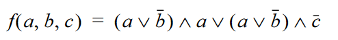
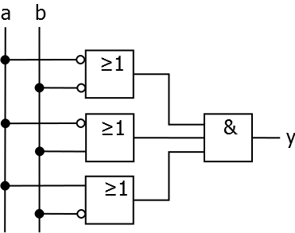

_Übungsaufgabe zur Veranstaltung [IT
Systeme](https://hsro-wif-it.github.io) im [Bachelorstudiengang
Wirtschaftsinformatik](https://www.th-rosenheim.de/technik/informatik-mathematik/wirtschaftsinformatik-bachelor/) an der [Hochschule Rosenheim](http://www.th-rosenheim.de)._

# 14 - Klausurvorbereitung

Diese Übung dient speziell der Klausurvorbereitung und beinhaltet Aufgaben, die so ähnlich in der Klausur vorkommen könnten.

> Note: **Lösungen im _Musterlösung_ Branch!**

## Aufgabe 1: Rechnerarchitektur (5P)

Beschreiben Sie die Grundzüge der _Harvard-Prozessorarchitektur_.

## Aufgabe 2: Caching (8P + 8P)

Sie haben zwei Caches: Einen mit 4 Plätzen und einen mit 5 Plätzen. Folgende Zahlen werden der Reihe nach angefragt

1 3 5 4 2 4 3 2 1 0 5 3 5 0 4 3 5 4 3 2 1 3 4 5


### a)
Schreiben Sie die Cache-Belegung auf, wenn die Ersetzungstrategie **Least Recently Used (LRU)** ist

Wie sieht die Cache Belegung jeweils bei 4 Plätzen aus?
Wie hoch ist die **Hitrate** und die **Missrate**?

Wie sieht die Cache Belegung jeweils bei 5 Plätzen aus?
Wie hoch ist die **Hitrate** und die **Missrate**?

### b)
Schreiben Sie die Cache-Belegung auf, wenn die Ersetzungstrategie **First in First out (FIFO)** ist

Wie sieht die Cache Belegung jeweils bei 4 Plätzen aus?
Wie hoch ist die **Hitrate** und die **Missrate**?

Wie sieht die Cache Belegung jeweils bei 5 Plätzen aus?
Wie hoch ist die **Hitrate** und die **Missrate**?

## Aufgabe 3: Schaltnetze (3P + 5P + 7P)

### a)

Skizzieren Sie das Schaltnetz eines **Halbaddierer** und schreiben Sie die Wertetabelle auf.


### b)

Formen Sie folgende Schaltfunktion so um, daß sie aus schließlich mit NAND-Schaltgliedern realisiert werden kann:



### c)

1. Ermittle für die angegebene Schaltung die zugehörige Schaltgleichung. Vereinfache diese anschließend weitestmöglich.




2. Formen Sie die vereinfachte Schaltgleichung so um, dass sie nur eine Sorte Logikgatter enthält.


## Aufgabe 4: Betriebssysteme (3P + 5P + 7P)

### a)

Nennen Sie mindestens 4 Komponenten/ Aufgaben eines Betriebsystems.

### b)

Wie ist ein _Prozess_ definiert und welche _Prozesszustaende_ gibt es (Nennen Sie mindestes 3!).

### c)

Schreiben Sie ein Batch/Shell - Skript `create.sh`, das einen Parameter n übergeben bekommt und die Anzahl n Verzeichnisse erstellt und in jedem Verzeichnis 2 leere Dateien (`datei1.txt` und `datei2.txt`) ablegt.

Verwenden sie die Shell-Befehle: `touch`, `mkdir`, `cd`, `for`

Folgender Aufruf
```shell
$ create.sh 3
```

erzeugt dann die folgende Struktur
```shell
- folder1
  - datei1.txt
  - datei2.txt
- folder2
  - datei1.txt
  - datei2.txt
- folder3
  - datei1.txt
  - datei2.txt
```

## Aufgabe 5: Netzwerk (8P + 8P)

### a) Link Layer

Ein Link-Layer Protokoll verwendet folgende Zeichenkodierung:

A     01000111
B     11100011
FLAG	01111110
ESC  	11100000

Es soll der 4-Character-Frame „A B ESC FLAG“ übertragen werden. 

Welche Bitsequenz wird auf der Physical Layer jeweils in folgenden Fällen übertragen?
-	**Byte Count**: Am Anfang des Frames wird die Länge des Frames binär-kodiert übertragen.
-	**Byte Stuffing**: Anfang und Ende des Frames wird durch FLAG Zeichen markiert.
-	**Bit Stuffing**: Anfang und Endes des Frames wird durch FLAG Zeichen markiert. Der Link Layer verwendet Bit Stuffing, falls sie das Bit 1 fünfmal hintereinander senden muss.

### b) Fehlererkennung und Fehlerkorrektur

**CRC**: Gegeben sei das Generatorpolynom G = 1001. Es sollen die Datenbits 01101010101 übertragen werden. Berechnen Sie, welche CRC Bits mitgesendet werden müssen!

Erklären Sie, was der Empfänger machen müsste um zu überprüfen, dass die CRC Prüfsumme mit dem Dateninhalt übereinstimmt.  


## Aufgabe 6: HTTP und ReST (3P + 5P + 3P)

### a)

Nennen Sie die 4 wichtigsten HTTP Commands und deren Funktion.

### b)

Angenommen es gibt einen Rest Service unter der URL `https://openmensa.org/api/v2`

- mit dem Pfad `/canteens` laesst sich die Liste der Kantinen abfragen
- mit dem Pfad `/canteens/:id` laesst sich eine spezielle Kantine abfragen (wobei `:id` eine Zahl zwischen 1 und 100 sein muss!)

Aufgabe:
- Welche Shell-Commands kann man verwenden. Nennen Sie mindestens 1!
- Wie lauten die Aufrufe?

### c)

Angenommen Ihre Anfrage an einen Rest-Service schickt folgende Antwort:

```java
{
  "id": 1,
  "name": "Mensa UniCampus Magdeburg",
  "city": "Magdeburg",
  "addressen": "Pfälzer Str. 1, 39106 Magdeburg",
}
```

- Wie nennt sich das Datenformat?
- Was würde sich ändern, wenn eine Liste von Kantinen zurückgegeben würde?

## Aufgabe 7: Cluster und Cloud (4P + 8P)

### a) Cloud

Welche 3 **Servicemodelle** gibt es als Cloud-Angebote? Benennen Sie diese und erklären Sie diese kurz.

### b) Amdahl's Law

Gegeben ist eine Aufgabe A, die sich in einen sequentiellen Anteil (grün markiert), einen parallelen Anteil, der sich nur auf GPUs ausführen lässt (rot markeiert) und einen parallelen Anteil, der sich nur auf CPU ausführen lässt (blau markiert).


Wie gross ist der Anteil an der gesamten Aufgabe?
- seq
- paral. CPU
- paral. GPU


Die Anzahl der GPUs sei m, die Anzahl der CPUs sei n.

Welche Geschwindigkeitsvorteile ergeben sich? Füllen Sie die folgende Matrix aus.

m/n|   1     |    5     |    10   |    20    |
---|---------|----------|---------|----------|
1  |         |          |         |          |
5  |         |          |         |          |
10 |         |          |         |          |
20 |         |          |         |          |


**Fertig!!!**