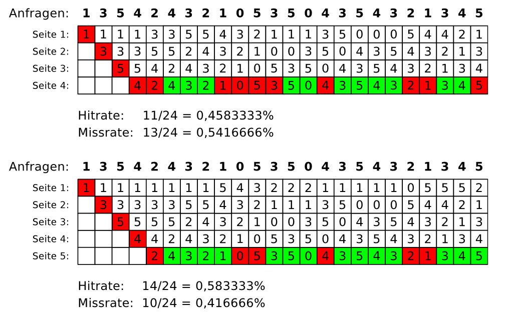
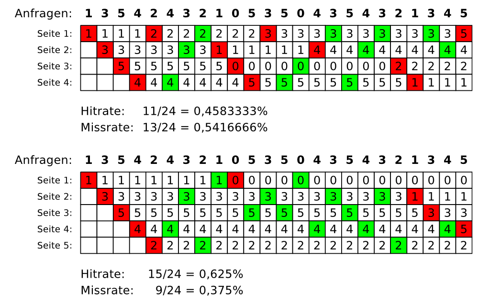
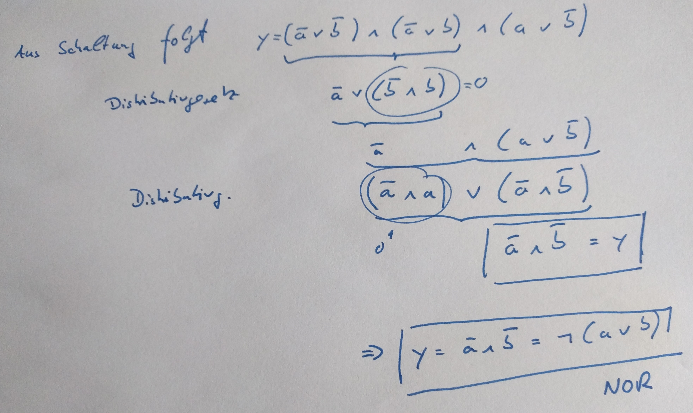

_Übungsaufgabe zur Veranstaltung [IT
Systeme](https://hsro-wif-it.github.io) im [Bachelorstudiengang
Wirtschaftsinformatik](https://www.th-rosenheim.de/technik/informatik-mathematik/wirtschaftsinformatik-bachelor/) an der [Hochschule Rosenheim](http://www.th-rosenheim.de)._

# 14 - Klausurvorbereitung

Diese Übung dient speziell der Klausurvorbereitung und beinhaltet Aufgaben, die so ähnlich in der Klausur vorkommen könnten.

> Note: **Lösungen im _Musterlösung_ Branch!**

## Aufgabe 1: Rechnerarchitektur (5P)

Beschreiben Sie die Grundzüge der _Harvard-Prozessorarchitektur_.

**Lösung**

Das Hauptmerkmal der Harvard-Architektur ist, dass Programm- und Datenspeicher über getrennte Busse angesteuert werden. Daraus ergibt sich der Vorteil, dass auf Daten- und Programmspeicher gleichzeitig zugegriffen werden kann. Es bedeutet aber auch, dass der echte Code im Datenspeicher nicht ausgeführt werden kann


## Aufgabe 2: Caching (8P + 8P)

Sie haben zwei Caches: Einen mit 4 Plätzen und einen mit 5 Plätzen. Folgende Zahlen werden der Reihe nach angefragt

1 3 5 4 2 4 3 2 1 0 5 3 5 0 4 3 5 4 3 2 1 3 4 5


### a)
Schreiben Sie die Cache-Belegung auf, wenn die Ersetzungstrategie **Least Recently Used (LRU)** ist

Wie sieht die Cache Belegung jeweils bei 4 Plätzen aus?
Wie hoch ist die **Hitrate** und die **Missrate**?

Wie sieht die Cache Belegung jeweils bei 5 Plätzen aus?
Wie hoch ist die **Hitrate** und die **Missrate**?

**Lösung**

Wenn bei der Ersetzungsstrategie LRU eine Seite verdrängt werden
muss, wird die Seite verdrängt, auf die am längsten nicht zugegriffen wurde.



### b)
Schreiben Sie die Cache-Belegung auf, wenn die Ersetzungstrategie **First in First out (FIFO)** ist

Wie sieht die Cache Belegung jeweils bei 4 Plätzen aus?
Wie hoch ist die **Hitrate** und die **Missrate**?

Wie sieht die Cache Belegung jeweils bei 5 Plätzen aus?
Wie hoch ist die **Hitrate** und die **Missrate**?

**Lösung**

Wenn bei der Ersetzungsstrategie FIFO eine Seite verdrängt werden
muss, wird die Seite verdrängt, die sich am längsten im Speicher befindet.




## Aufgabe 3: Schaltnetze (3P + 5P + 7P)

### a)

Skizzieren Sie das Schaltnetz eines **Halbaddierer** und schreiben Sie die Wertetabelle auf.

**Lösung**

x |	y |	Übertrag c |	Summe s|
--|---|------------|---------|
0 |	0 |	    0      |	  0    |
0 |	1 |	    0      |	  1    |
1 |	0 |	    0 	   |    1    |
1 |	1 |	    1    	 |    0    | 


### b)

1. Ermittle für die angegebene Schaltung die zugehörige Schaltgleichung. Vereinfache diese anschließend weitestmöglich.


2. Formen Sie die vereinfachte Schaltgleichung so um, dass sie nur eine Sorte Logikgatter enthält.

**Lösung**




## Aufgabe 4: Betriebssysteme (3P + 5P + 7P)

### a)

Nennen Sie mindestens 4 Komponenten/ Aufgaben eines Betriebsystems.

**Lösung**

- Auftragsverwaltung, Programmausführung
- Programmerstellung
- Prozessveraltung und -koordinierung
- Kommunikation: I/O, Filezugriff, Netzwerkkommunikation 
- Benutzerverwaltung, Zugangskontrolle 
- Fehlererkennung und Behandlung 
- Logging (Überwachung, Accounting) 
- Betriebsmittel- und Dateiverwaltung

### b)

Wie ist ein _Prozess_ definiert und welche _Prozesszustaende_ gibt es (Nennen Sie mindestes 3!).

**Lösung**


_Ein (sequentieller) **Prozess (process, auch: task)** ist eine dynamische Fol­ge von Aktionen (Zustandsänderungen), die durch Ausführung eines Pro­gramms auf einem Prozessor zustande kommt. Ein Prozess ist insbesonde­re durch seinen zeitlich veränderlichen Zustand gekennzeichnet. Er wird im Betriebssystem infolge eines Auftrags erzeugt._

Zustände:

- **aktiv (auch rechnend, running)**: Der betreffende Prozess hat einen Prozessor zugeteilt bekommen und schreitet voran (er „läuft“).
- **bereit (auch laufbereit, ready)**: Der Prozess wartet nur noch auf die Zutei­lung eines Prozessors (keine weiteren Wartebedingungen).
- **wartend (auch blockiert, suspendiert, waiting)**: Der Prozess muss auf die Erfüllung (mindestens) einer Wartebedingung warten.
- **nicht existent (non existing)**: „Formaler“ Zustand für Prozesse, die noch nicht oder nicht mehr im System existieren. 

### c)

Schreiben Sie ein Batch/Shell - Skript `create.sh`, das einen Parameter n übergeben bekommt und die Anzahl n Verzeichnisse erstellt und in jedem Verzeichnis 2 leere Dateien (`datei1.txt` und `datei2.txt`) ablegt.
 
Verwenden sie die Shell-Befehle: `touch`, `mkdir`, `cd`, `for`

Folgender Aufruf
```shell
$ create.sh 3
```

erzeugt dann die folgende Struktur
```shell
- folder1
  - datei1.txt
  - datei2.txt
- folder2
  - datei1.txt
  - datei2.txt
- folder3
  - datei1.txt
  - datei2.txt
```

**Lösung**

```shell
#!/bin/sh

I=1
while [ $I -le $1 ]
do
    mkdir "folder$I"
    cd "folder$I"
    touch "datei1.txt"
    touch "datei2.txt"
    cd ..
    I=$(( $I +1 ))
done
```

## Aufgabe 5: Netzwerk (8P + 8P)

### a) Link Layer

Ein Link-Layer Protokoll verwendet folgende Zeichenkodierung:

A     01000111
B     11100011
FLAG	01111110
ESC  	11100000

Es soll der 4-Character-Frame „A B ESC FLAG“ übertragen werden. 

Welche Bitsequenz wird auf der Physical Layer jeweils in folgenden Fällen übertragen?
-	**Byte Count**: Am Anfang des Frames wird die Länge des Frames binär-kodiert übertragen.
-	**Byte Stuffing**: Anfang und Ende des Frames wird durch FLAG Zeichen markiert.
-	**Bit Stuffing**: Anfang und Endes des Frames wird durch FLAG Zeichen markiert. Der Link Layer verwendet Bit Stuffing, falls sie das Bit 1 fünfmal hintereinander senden muss.

**Lösung**

Falls die Link Layer „A B ESC FLAG“ (entspricht 01000111 11100011 11100000 01111110) übertragen möchte, so ergeben sich auf der Physical Layer je nach Verfahren unterschiedliche Bitsequenzen: 

-	Byte Count: Am Anfang wird ein Byte-Wert hinzugefügt, der die Gesamtlänge des Frames angibt. Im konkreten Fall ist das 5 (00000101), wenn man das Längenfeld mitrechnet. Es ergibt sich: 00000101 01000111 11100011 11100000 01111110.
-	Byte Stuffing: Anfang und Ende des Frames wird durch FLAG Zeichen markiert. Man beachte, dass ESC-Zeichen ggfs. hinzugefügt werden müssen. Er ergibt sich 
01111110 01000111 11100011 11100000 11100000 11100000 01111110 01111110
-	Bit Stuffing: Bei Bit Stuffing darf nur am Frameanfang und Frameende 6mal hintereinander die 1 gesendet werden. 
01111110 01000111 110100011 111000000 011111010 01111110


### b) Fehlererkennung und Fehlerkorrektur

**CRC**: Gegeben sei das Generatorpolynom G = 1001. Es sollen die Datenbits 01101010101 übertragen werden. Berechnen Sie, welche CRC Bits mitgesendet werden müssen!

Erklären Sie, was der Empfänger machen müsste um zu überprüfen, dass die CRC Prüfsumme mit dem Dateninhalt übereinstimmt.  

**Lösung**

**G = 1001** → Das entsprechende Generatorpolynom würde lauten:  x^3+1

Bei einem Generatorpolynom vom Grad 3 hängt man zunächst 3 0er Bits an die Bitfolge von D=01101010101 an und dividiert dann durch das Generatorpolynom, im konkreten Fall: 

```
01101010101000
 1001
  1000
  1001
     1101
 -   1001
      1000
      1001
         1100
         1001
          1010
          1001
            11  (Rest 11) 
```

Es müssen die 3 CRC-Bits mitgesendet werden, in diesem Fall (Rest 11), also 011. 

Der Empfänger muss die Division 01101010101|011 : 1001 durchführen. Falls dann kein Rest entsteht, nimmt der Empfänger an, dass es bei der Übertragung keine Bitfehler gab. 


## Aufgabe 6: HTTP und ReST (3P + 5P + 3P)

### a)

Nennen Sie die 4 wichtigsten HTTP Commands und deren Funktion.

**Lösung**
- _GET_: Anfordern von Ressourcen
- _PUT_: Ändern von Ressourcen
- _POST_: Anlegen von Ressourcen
- _DELETE_: Löschen von Ressourcen

### b)

Angenommen es gibt einen Rest Service unter der URL `https://openmensa.org/api/v2`

- mit dem Pfad `/canteens` laesst sich die Liste der Kantinen abfragen
- mit dem Pfad `/canteens/:id` laesst sich eine spezielle Kantine abfragen (wobei `:id` eine Zahl zwischen 1 und 100 sein muss!)

Aufgabe:
- Welche Shell-Commands kann man verwenden. Nennen Sie mindestens 1!
- Wie lauten die Aufrufe?

**Lösung**

```shell
$ curl -i https://openmensa.org/api/v2/canteens
$ curl -X GET https://openmensa.org/api/v2/canteens

$ curl -i https://openmensa.org/api/v2/canteens/1
$ curl -X GET https://openmensa.org/api/v2/canteens/1
```

### c)

Angenommen Ihre Anfrage an einen Rest-Service schickt folgende Antwort:

```java
{
  "id": 1,
  "name": "Mensa UniCampus Magdeburg",
  "city": "Magdeburg",
  "addressen": "Pfälzer Str. 1, 39106 Magdeburg",
}
```

- Wie nennt sich das Datenformat?
- Was würde sich ändern, wenn eine Liste von Kantinen zurückgegeben würde?

**Lösung**

- Das Format nennt man JSON (=JavaScript Object Notation)
- Eckige, umschliessende Klammern

```
[
  {
    "id": 1,
    "name": "Mensa UniCampus Magdeburg",
    "city": "Magdeburg",
    "address": "Pfälzer Str. 1, 39106 Magdeburg",
    "coordinates": null
  },
  {
    "id": 104,
    "name": "Bistro Tasty Studio Babelsberg",
    "city": "Potsdam",
    "address": "August-Bebel-Str. 26-53, 14482 Potsdam, Deutschland",
    "coordinates": [
      52.3877669669544,
      13.1209909915924
    ]
  }
]
```

## Aufgabe 7: Cluster und Cloud (4P + 8P)

### a) Cloud

Welche 3 **Servicemodelle** gibt es als Cloud-Angebote? Benennen Sie diese und erklären Sie diese kurz.

**Lösung**

- _Infrastructure as a Service (IaaS)_: Bereitstellung der Rechner und Netzwerk; Administration übernimmt der Kunde
- _Plattform as a Service (PaaS)_: Bereitstellung der _installierten_ Rechner und Netzwerk; Administration übernimmt der Anbieter
- Software as a Service (SaaS): Fertige Softwarepakete; Konfiguration durch Kunde

### b) Amdahl's Law

Gegeben ist eine Aufgabe A, die sich in einen sequentiellen Anteil (grün markiert), einen parallelen Anteil, der sich nur auf GPUs ausführen lässt (rot markeiert) und einen parallelen Anteil, der sich nur auf CPU ausführen lässt (blau markiert).


Wie gross ist der Anteil an der gesamten Aufgabe?
- seq
- paral. CPU
- paral. GPU


Die Anzahl der GPUs sei m, die Anzahl der CPUs sei n.

Welche Geschwindigkeitsvorteile ergeben sich? Füllen Sie die folgende Matrix aus.

m/n|   1     |    5     |    10   |    20    |
---|---------|----------|---------|----------|
1  |         |          |         |          |
5  |         |          |         |          |
10 |         |          |         |          |
20 |         |          |         |          |

**Lösung**
- seq       : 5/20
- paral. CPU: 6/20
- paral. GPU: 9/20

m/n|   1     |    5     |    10   |    20    |
---|---------|----------|---------|----------|
1  |   1     |   1.32   |    1.37 |  1.40    |
5  |   1.56  |   2.5    |    2.70 |  2.82    |
10 |   1.68  |   2.82   |    3.08 |  3.23    |
20 |   1.75  |   3.01   |    3.31 |  3.48    |

**Fertig!!!**
